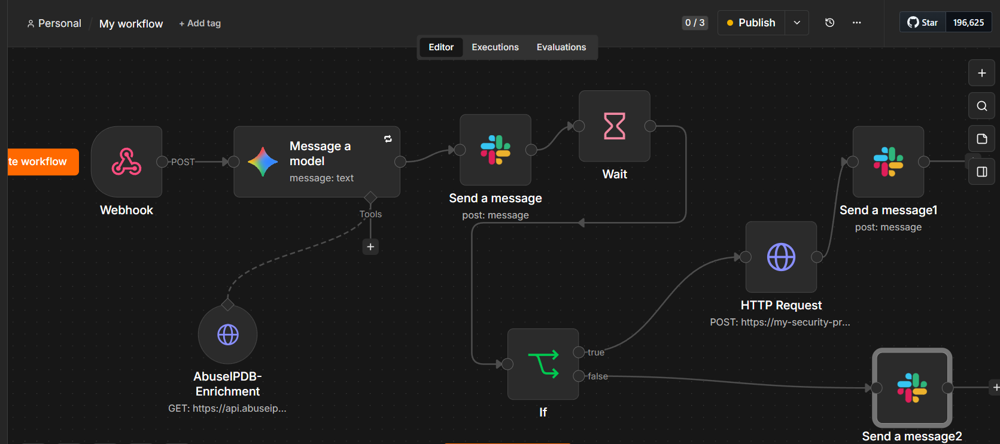
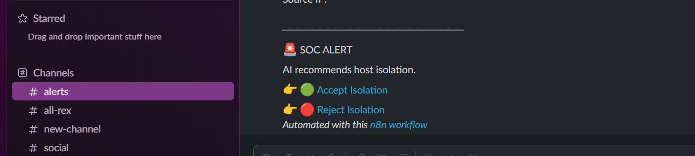
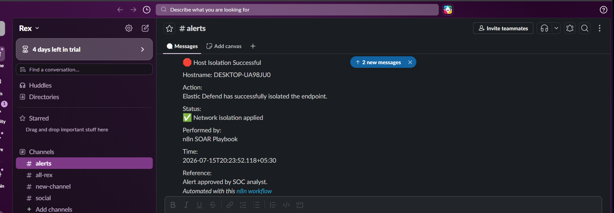
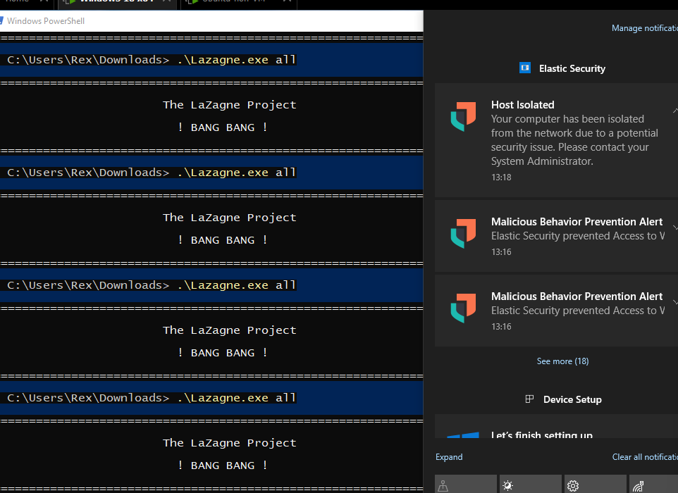
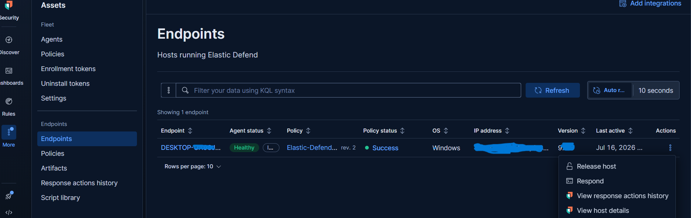
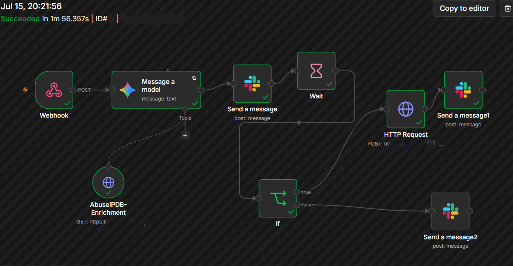
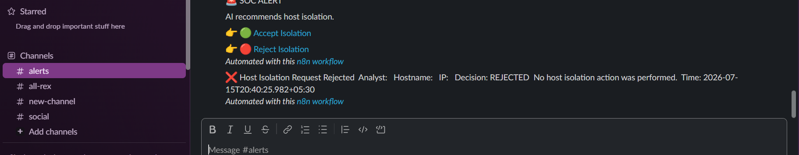
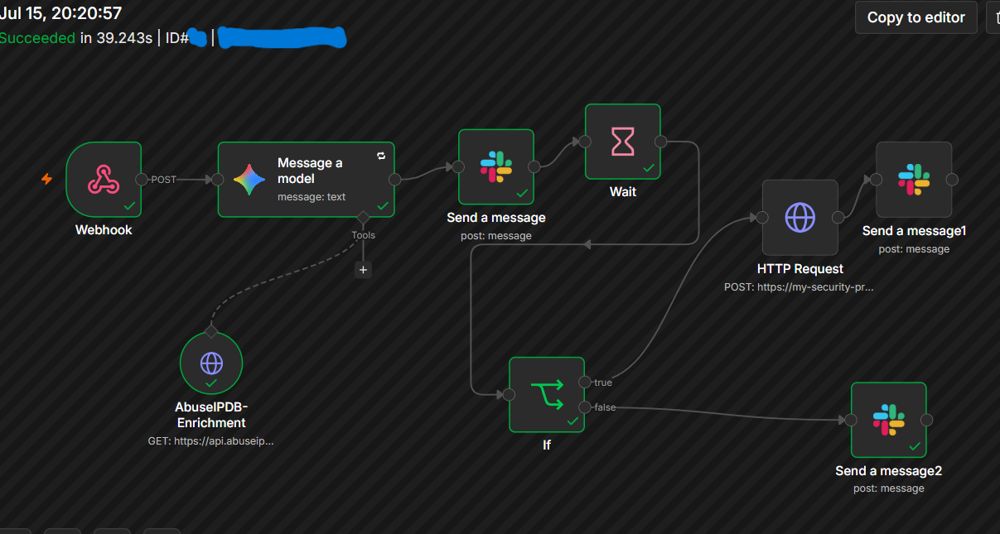
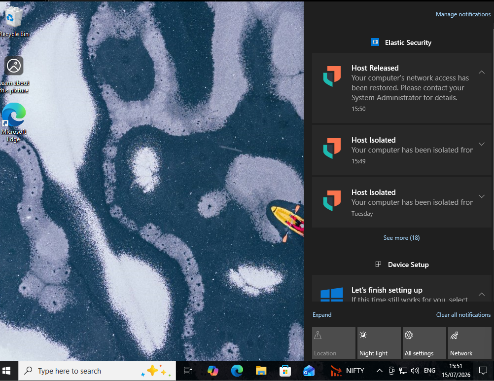
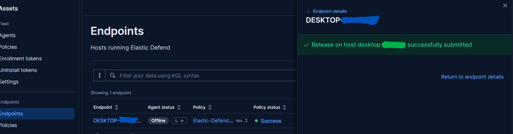

# SOC-AI-Incident-Response-Automation

An end-to-end Security Operations Center (SOC) automation project that integrates Splunk SIEM, Elastic Defend,  n8n, Google Gemini AI, AbuseIPDB,  and Slack to automate alert enrichment, analyst approval, and endpoint isolation.

---

## 📌 Project Overview

Security Operations Center (SOC) analysts often spend valuable time manually investigating alerts, enriching Indicators of Compromise (IOCs), notifying analysts, and performing endpoint containment.

This project automates the complete incident response workflow after a high-severity alert is generated.

The workflow receives alerts from Splunk via Webhook, enriches indicators using AbuseIPDB, performs AI-powered incident analysis with Google Gemini, requests analyst approval through Slack, and automatically isolates the affected endpoint using Elastic Defend after approval.

This demonstrates how AI-assisted automation can reduce analyst workload, improve response time, and standardize incident handling while still keeping a human-in-the-loop for critical response actions.

---

---

# 🛠 Tech Stack

| Category | Technology |
|----------|------------|
| SIEM | Splunk Enterprise |
| Workflow Automation | n8n |
| Artificial Intelligence | Google Gemini AI |
| Threat Intelligence | AbuseIPDB API |
| Collaboration | Slack |
| Endpoint Detection & Response | Elastic Defend |
| API Communication | REST APIs |
| Containerization | Docker |
| Operating System | Ubuntu Server, Windows 10 |


## 🏗 Workflow Architecture
```text
Splunk Alert
      │
      ▼
Webhook (n8n)
      │
      ▼
Google Gemini AI
(Alert Summary & Severity)
      │
      ▼
AbuseIPDB
(IOC Enrichment)
      │
      ▼
Slack Analyst Approval
      │
 ┌────┴────┐
 │         │
Approve   Reject
 │         │
 ▼         ▼
Elastic   Slack Notification
Defend
(Isolate Host)
 │
 ▼
Slack Confirmation
```

---

## ✨ Key Features

- Automated incident response workflow using n8n
- AI-powered incident summarization using Google Gemini
- IOC enrichment using AbuseIPDB
- Analyst approval workflow through Slack
- Automatic endpoint isolation using Elastic Defend
- Human-in-the-loop decision making
- Reject path with analyst notification
- REST API integration with AbuseIPDB, Google Gemini AI, Slack, and Elastic Defend

---

# ⚙️ How It Works

1. Splunk detects a high-severity security alert and triggers the workflow through an n8n Webhook.
2. Google Gemini AI analyzes the alert and generates an incident summary, severity assessment, and recommended actions.
3. AbuseIPDB enriches the source IP address with threat intelligence.
4. A Slack approval request is sent to the SOC analyst containing the AI analysis and IOC enrichment.
5. The analyst chooses either:
   - ✅ Approve Isolation
   - ❌ Reject Request
6. If approved, n8n calls the Elastic Defend REST API to isolate the endpoint.
7. If rejected, the workflow terminates and sends a rejection notification to Slack.
8. Every step is automatically logged within n8n for auditing and troubleshooting.


# 📸 Project Demonstration

## 1. Complete Automation Workflow




---

## 2. Analyst Approval via Slack



---

## 3. Analyst Approved




## 4. Endpoint  Isolation



---

## 5. Endpoint Successfully Isolated



---

## 6. Successful n8n Workflow Execution



---

## 7. Analyst Rejected



---

## 8. Rejected n8n Workflow Execution



---

## 9. Endpoint Unisolation



---

## 10. Endpoint Successfully Released



---

